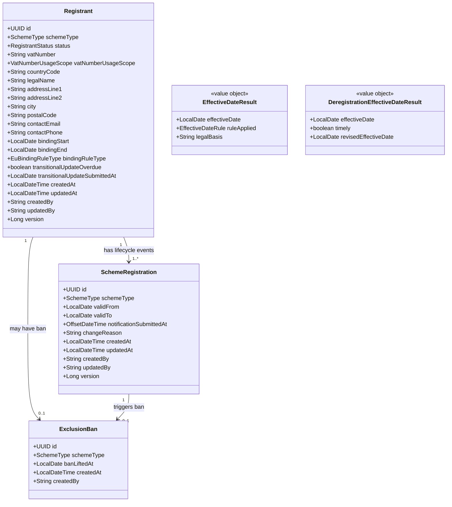
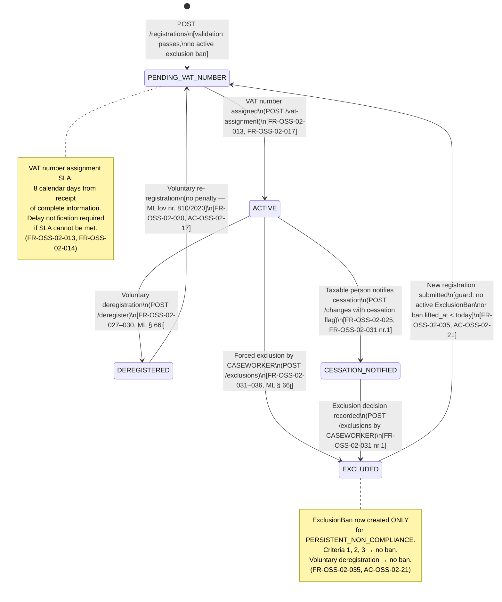

# OSS-02 — Solution Architecture: Registration and Deregistration Lifecycle

| Field | Value |
|---|---|
| **Document ID** | OSS-02-SA |
| **Petition** | `petitions/OSS-02/OSS-02.md` |
| **Outcome Contract** | `petitions/OSS-02/OSS-02-outcome-contract.md` |
| **Specification** | `design/specs/OSS-02-registration-spec.md` |
| **Feature File** | `petitions/OSS-02/OSS-02.feature` (42 scenarios) |
| **Status** | APPROVED |
| **Service** | `osm2-registration-service` (port 8082) |
| **Legal basis** | ML §§ 66a–66j; Momsbekendtgørelsen §§ 115–119; Momsforordningen art. 57d–58c |
| **ADR bindings** | ADR-0033 (bitemporality), ADR-0013 (audit), ADR-0014 (PII silo), ADR-0019 (orchestration), ADR-0031 (enum placement) |

---

## 1. Overview

### 1.1 Purpose

This document defines the solution architecture for the registration and deregistration lifecycle of the Danish VAT OSS (One-Stop-Shop) system under the **Non-EU scheme** (ML §§ 66a–66c) and **EU scheme** (ML §§ 66d–66g). Denmark acts as the identification member state for all registrations in scope.

The architecture transforms 38 functional requirements (FR-OSS-02-001 through FR-OSS-02-038) and 25 acceptance criteria (AC-OSS-02-01 through AC-OSS-02-25) into executable component boundaries, data contracts, and behavioural constraints that engineers can build from without ambiguity.

### 1.2 Scope

| In scope | Out of scope |
|---|---|
| Electronic registration (Non-EU and EU schemes) | Import scheme (Importordningen) — OSS-03 |
| Effective-date calculation (quarter rule + early-delivery exception) | VAT return filing — OSS-04 |
| VAT number assignment within 8 calendar days | Payment processing — OSS-05 |
| EU scheme binding rule enforcement | Cross-border EU data exchange |
| Change notification processing (10-day compliance tracking) | Ordinary Danish VAT registration |
| Voluntary deregistration (15-day advance notice) | Refund/deduction mechanics (ML §§ 66c, 66f) |
| Forced exclusion (4 criteria, 2 effective-date rules) | Appeals against exclusion decisions |
| 2-year re-registration ban (criterion 4 only) | |
| Scheme switching without gap or overlap | |
| Transitional provision enforcement (pre-July-2021 registrants) | |

### 1.3 Key Design Decisions

| Decision | Rationale | ADR |
|---|---|---|
| **PII silo in `osm2-registration-service`** | All taxable person identity data (VAT numbers, addresses, contacts) lives exclusively in this service. Other services reference registrants by `registrant_id` UUID only. | ADR-0014 |
| **Bitemporal data model** | Six distinct legal rules mandate independent tracking of valid time (gyldighedstid) and transaction time (registreringstid). Explicit `valid_from`/`valid_to` columns for domain axis; Hibernate Envers `_AUD` tables for system axis. | ADR-0033 |
| **Orchestration over events** | The registration lifecycle involves sequential business rules with mandatory rollback semantics (e.g. exclusion + scheme switch). Synchronous orchestration in `RegistrationService` is preferred over choreography. | ADR-0019 |
| **Enums in `osm2-common`** | `SchemeType` is shared across services; defined once in `osm2-common`, imported transitively. | ADR-0031, ADR-0035 |
| **Stateless date calculator** | `EffectiveDateCalculationService` is a pure function with no database access. It is isolated to permit exhaustive unit testing of all boundary cases without Spring context. | Spec §4.3 |
| **Caseworker-only exclusion** | `ExclusionService.recordExclusion` enforces `CASEWORKER` role at the service layer, not only at the API layer, to prevent privilege escalation via internal calls. | FR-OSS-02-032, AC-OSS-02-23 |

---

## 2. Domain Model

### 2.1 Entity Diagram



### 2.2 Aggregate Boundaries

| Aggregate Root | Owned Entities | External References |
|---|---|---|
| `Registrant` | `SchemeRegistration`, `ExclusionBan` | None (PII silo — no FK to other services) |

`Registrant` is the aggregate root. All mutations to `SchemeRegistration` and `ExclusionBan` MUST flow through the service layer, never via direct repository calls from outside the service package boundary.

### 2.3 Enum Definitions

#### `RegistrantStatus` — `dk.osm2.registration.domain`

| Value | Meaning | Legal basis |
|---|---|---|
| `PENDING_VAT_NUMBER` | Registration submitted; VAT number not yet assigned | ML § 66b stk. 2, § 66e stk. 1 |
| `ACTIVE` | Confirmed; VAT number assigned and valid | ML § 66b stk. 2 |
| `CESSATION_NOTIFIED` | Taxable person notified cessation; awaiting exclusion decision | FR-OSS-02-025 |
| `DEREGISTERED` | Voluntary deregistration effective | ML § 66i |
| `EXCLUDED` | Forced exclusion effective | ML § 66j |

> **V3 migration note:** V1 schema uses `PENDING` and `SUSPENDED`. These must be reconciled. See OQ-2 and §9 (Persistence) below.

#### `SchemeType` — `dk.osm2.common` (shared)

| Value | ML Reference | MSD Reference |
|---|---|---|
| `NON_EU` | ML § 66a | MSD art. 358a |
| `EU` | ML § 66d | MSD art. 369a |
| `IMPORT` | ML § 66m | MSD art. 369l |

#### `ExclusionCriterion` — `dk.osm2.registration.domain`

| Value | Meaning | 2-year ban? | Legal basis |
|---|---|---|---|
| `CESSATION_NOTIFICATION` | Taxable person self-reported cessation | No | ML § 66j stk. 1 nr. 1 |
| `PRESUMED_CESSATION` | No supplies for 2 consecutive years | No | ML § 66j stk. 1 nr. 2 |
| `CONDITIONS_NOT_MET` | Eligibility conditions no longer met | No | ML § 66j stk. 1 nr. 3 |
| `PERSISTENT_NON_COMPLIANCE` | Persistent failure to comply with scheme rules | **Yes** | ML § 66j stk. 1 nr. 4 |

#### `EuBindingRuleType` — `dk.osm2.registration.domain`

| Value | Meaning | Legal basis |
|---|---|---|
| `ML_66D_STK2` | Binding rule applies; Denmark selected under case (b) or (c) | ML § 66d stk. 2 |
| `NOT_APPLICABLE` | Case (a): home establishment in Denmark; no binding commitment | ML § 66d stk. 1 nr. 1 |

#### `ChangeNotificationStatus` — `dk.osm2.registration.domain`

| Value | Meaning |
|---|---|
| `TIMELY` | Submitted on or before 10th day of month following the change |
| `LATE_NOTIFICATION` | Submitted after 10th day; flagged for compliance review |

#### `VatNumberUsageScope` — `dk.osm2.registration.domain`

| Value | Meaning | Legal basis |
|---|---|---|
| `NON_EU_SCHEME_ONLY` | Number usable only for Non-EU scheme; not valid for other VAT purposes | MSD art. 362 |
| `EU_SCHEME` | EU scheme VAT number (new assignment or linked existing Danish number) | MSD art. 369d |

#### `EffectiveDateRule` — `dk.osm2.registration.domain` (non-persisted)

| Value | Meaning |
|---|---|
| `QUARTER_START` | First day of calendar quarter following notification (ML § 66b stk. 2) |
| `EARLY_DELIVERY_EXCEPTION` | First delivery date; notified within 10-day window (ML § 66b stk. 3) |

---

## 3. Registration State Machine



**Guard conditions:**

| Transition | Guard | Exception on failure |
|---|---|---|
| `[*] → PENDING_VAT_NUMBER` | All mandatory fields valid; no active `ExclusionBan` row | `RegistrationValidationException` (400) or `ExclusionBanActiveException` (409) |
| `ACTIVE → EXCLUDED` (criterion 4) | Caller holds `CASEWORKER` role | `UnauthorisedExclusionActorException` (403) |
| `EXCLUDED → PENDING_VAT_NUMBER` | `ExclusionBan.banLiftedAt < LocalDate.now()` OR no ban row exists | `ExclusionBanActiveException` (409) |
| Any unknown transition | — | `IllegalStateTransitionException` |

**Forbidden transitions (throw `IllegalStateTransitionException` immediately):**
- `DEREGISTERED → ACTIVE` (re-registration must go through `PENDING_VAT_NUMBER`)
- `EXCLUDED → ACTIVE` (same — must re-register)
- `PENDING_VAT_NUMBER → EXCLUDED` (cannot exclude before VAT number is assigned)
- Any other transition not listed in the state machine above

---

## 4. Effective Date Algorithm

### 4.1 Registration Effective Date

**Owner:** `EffectiveDateCalculationService.computeEffectiveDate()`  
**Legal basis:** ML § 66b stk. 2–3 (Non-EU); ML § 66e stk. 2 (EU); Momsforordningen art. 57d  
**Applies identically to both schemes.**

```
INPUTS:
  notificationDate  : LocalDate   — date the notification is submitted to SKAT
  firstDeliveryDate : LocalDate?  — null if no prior eligible delivery

ALGORITHM:
  IF firstDeliveryDate IS NULL THEN
    → Apply QUARTER_START rule

  ELSE
    deadline := 10th calendar day of (month of firstDeliveryDate + 1)
    IF notificationDate <= deadline THEN
      → Apply EARLY_DELIVERY_EXCEPTION: effectiveDate = firstDeliveryDate
    ELSE
      → Apply QUARTER_START rule

QUARTER_START computation:
  quarterStartMonth := ((notificationDate.monthValue - 1) / 3 + 1) * 3 - 2
                        // maps to: Jan=1, Apr=4, Jul=7, Oct=10
  candidateStart    := LocalDate.of(notificationDate.year, quarterStartMonth, 1)

  IF notificationDate == candidateStart THEN
    // Notification on the first day of a quarter → advance to NEXT quarter start
    candidateStart := candidateStart.plusMonths(3)

  RETURN candidateStart
```

**Calendar quarter definitions (statutory):**

| Quarter | First day | Last day |
|---|---|---|
| Q1 | 1 January | 31 March |
| Q2 | 1 April | 30 June |
| Q3 | 1 July | 30 September |
| Q4 | 1 October | 31 December |

### 4.2 Worked Examples — Registration

| Scenario | `notificationDate` | `firstDeliveryDate` | Deadline | Rule applied | `effectiveDate` |
|---|---|---|---|---|---|
| Normal: mid-quarter notification | 2024-02-15 | null | n/a | `QUARTER_START` | **2024-04-01** |
| Notification on first day of Q2 | 2024-04-01 | null | n/a | `QUARTER_START` (advance) | **2024-07-01** |
| Early delivery, notified on deadline | 2024-02-10 | 2024-01-20 | 2024-02-10 | `EARLY_DELIVERY_EXCEPTION` | **2024-01-20** |
| Early delivery, notified on day 10 | 2024-03-10 | 2024-02-08 | 2024-03-10 | `EARLY_DELIVERY_EXCEPTION` | **2024-02-08** |
| One day late after early delivery | 2024-02-11 | 2024-01-20 | 2024-02-10 | `QUARTER_START` (forfeited) | **2024-04-01** |
| EU: early delivery within window | 2024-06-10 | 2024-05-05 | 2024-06-10 | `EARLY_DELIVERY_EXCEPTION` | **2024-05-05** |
| EU: late notification forfeits exception | 2024-06-11 | 2024-05-05 | 2024-06-10 | `QUARTER_START` | **2024-07-01** |

### 4.3 Voluntary Deregistration Effective Date

**Owner:** `EffectiveDateCalculationService.computeDeregistrationEffectiveDate()`  
**Legal basis:** ML § 66i; Momsforordningen art. 57g stk. 1

```
INPUTS:
  notificationDate : LocalDate — date deregistration notification submitted

ALGORITHM:
  currentQuarterEnd  := last day of the calendar quarter containing notificationDate
  daysRemaining      := (currentQuarterEnd - notificationDate).toDays()
                        // exclusive of notificationDate; inclusive of quarterEnd

  IF daysRemaining >= 14 THEN
    // "At least 15 days before end of quarter" (inclusive counting, per feature file)
    effectiveDate := first day of next quarter after currentQuarterEnd
    timely        := true

  ELSE
    // Late — defer by one additional quarter
    effectiveDate := first day of the quarter two quarters ahead
    timely        := false
    // System MUST communicate revised effective date to taxable person (AC-OSS-02-16)
```

> **OQ-3 boundary:** The feature file implies inclusive counting (17 March to 31 March = 15 days). The comparison `daysRemaining >= 14` implements this correctly. **Confirm with legal/compliance before code-freeze** (see §11, OQ-3).

**Boundary cases:**

| `notificationDate` | Quarter end | `daysRemaining` | `timely` | `effectiveDate` |
|---|---|---|---|---|
| 2024-03-14 | 2024-03-31 | 17 | Yes | **2024-04-01** |
| 2024-03-17 | 2024-03-31 | 14 | Yes | **2024-04-01** |
| 2024-03-20 | 2024-03-31 | 11 | No | **2024-07-01** |

---

## 5. EU Binding Period

### 5.1 Rule Statement

**Legal basis:** ML § 66d stk. 2; Momsforordningen art. 369a

When a taxable person selects Denmark as identification member state under **case (b) or (c)** of ML § 66d stk. 1 (multiple fixed establishments or dispatch from multiple member states), that choice is **binding for the current calendar year and the 2 following calendar years**.

```
bindingRuleType := ML_66D_STK2
bindingStart    := registrationConfirmedDate
bindingEnd      := LocalDate.of(registrationConfirmedDate.year + 2, 12, 31)

Example:
  registrationConfirmedDate = 2024-09-15
  bindingEnd                = 2026-12-31
```

**Does NOT apply** to case (a) — home establishment in Denmark. Set `bindingRuleType = NOT_APPLICABLE`, `bindingStart = null`, `bindingEnd = null`.

### 5.2 Guard Condition

Before any request to change the identification member state away from Denmark:

```
IF bindingRuleType == ML_66D_STK2
   AND LocalDate.now() <= bindingEnd
   AND changeReason does NOT indicate loss of eligibility
THEN
  REJECT with EuBindingPeriodActiveException
  Error code: EU_BINDING_PERIOD_ACTIVE
  Include bindingEnd in error payload
```

### 5.3 Permitted Exception — Loss of Eligibility

If the home establishment or fixed establishment moves such that Denmark **no longer qualifies** as identification member state:

1. The change MUST be permitted, effective from the date of the establishment change
2. `changeReason` MUST explicitly state the legal grounds (e.g., `"Denmark no longer qualifies as IMS — establishment moved to [country] on [date] per ML § 66d stk. 1"`)
3. The binding clock **resets in the new identification member state** — outside this service's scope
4. `SchemeRegistration.valid_to` is set to the establishment change date (same rule as forced exclusion per Momsforordningen art. 58 stk. 2)

---

## 6. Exclusion Ban

### 6.1 Rule Statement

**Legal basis:** ML § 66j stk. 1 nr. 4

Only forced exclusion with criterion `PERSISTENT_NON_COMPLIANCE` creates a 2-year re-registration ban. All other criteria and voluntary deregistration **never** create a ban.

```
IF criterion == PERSISTENT_NON_COMPLIANCE THEN
  banLiftedAt := exclusionSchemeRegistration.validTo + 2 years

Example:
  exclusion valid_to = 2024-07-01
  banLiftedAt        = 2026-06-30
  → Re-registration allowed from 2026-07-01
```

### 6.2 Enforcement

Before creating any new `SchemeRegistration` for a `Registrant`, `RegistrationService` calls `ExclusionBanRepository`:

```sql
SELECT 1 FROM exclusion_ban
WHERE registrant_id = :id
  AND scheme_type = :scheme
  AND ban_lifted_at >= CURRENT_DATE
```

If a row exists: throw `ExclusionBanActiveException` (HTTP 409) with `banLiftedAt` in the error payload.

### 6.3 What Does NOT Trigger a Ban

| Event | Ban created? |
|---|---|
| Voluntary deregistration (`DEREGISTERED`) | **Never** — ML lov nr. 810/2020 abolished the re-entry penalty |
| Forced exclusion criterion 1 (`CESSATION_NOTIFICATION`) | No |
| Forced exclusion criterion 2 (`PRESUMED_CESSATION`) | No |
| Forced exclusion criterion 3 (`CONDITIONS_NOT_MET`) | No |
| Forced exclusion criterion 4 (`PERSISTENT_NON_COMPLIANCE`) | **Yes** — only this criterion |

---

## 7. REST API Contract

**Base path:** `/api/v1/registrations`  
**Security:** All endpoints require a valid JWT from `keycloak-oauth2-starter`. Role-based constraints are enforced at both API and service layer.

### 7.1 Endpoint Table

| # | Method | Path | Roles | Request DTO | Success Response | Error Codes |
|---|---|---|---|---|---|---|
| 1 | `POST` | `/api/v1/registrations` | `TAXABLE_PERSON`, `INTERMEDIARY`, `CASEWORKER` | `RegistrationRequest` | `201 RegistrantResponse` | `400 MISSING_REQUIRED_FIELD:<field>`, `409 EXCLUSION_BAN_ACTIVE`, `422 <business rule code>` |
| 2 | `GET` | `/api/v1/registrations/{registrantId}` | `TAXABLE_PERSON`, `INTERMEDIARY`, `CASEWORKER` | — | `200 RegistrantResponse` | `404 REGISTRANT_NOT_FOUND` |
| 3 | `POST` | `/api/v1/registrations/{registrantId}/changes` | `TAXABLE_PERSON`, `INTERMEDIARY`, `CASEWORKER` | `ChangeNotificationRequest` | `200 ChangeNotificationResponse` (with `notificationStatus`: `TIMELY` or `LATE_NOTIFICATION`) | `404`, `409 INVALID_STATUS` |
| 4 | `POST` | `/api/v1/registrations/{registrantId}/deregister` | `TAXABLE_PERSON`, `INTERMEDIARY`, `CASEWORKER` | `DeregistrationRequest` | `200 DeregistrationResponse` (with `effectiveDate`, `deferred`, `revisedEffectiveDate?`) | `404`, `409 INVALID_STATUS` |
| 5 | `POST` | `/api/v1/registrations/{registrantId}/exclusions` | `CASEWORKER` **only** | `ExclusionRequest` | `201 ExclusionResponse` (with `effectiveDate`, `criterion`, `banLiftedAt?`) | `403 UNAUTHORISED_EXCLUSION_ACTOR`, `404`, `409 INVALID_STATUS` |
| 6 | `POST` | `/api/v1/registrations/{registrantId}/vat-assignment` | `CASEWORKER`, `SERVICE` | `VatAssignmentRequest` | `200 RegistrantResponse` (status = `ACTIVE`) | `404`, `409 INVALID_STATUS` |
| 7 | `POST` | `/api/v1/registrations/{registrantId}/transitional-update` | `TAXABLE_PERSON`, `INTERMEDIARY`, `CASEWORKER` | `TransitionalUpdateRequest` | `200 RegistrantResponse` (flag cleared) | `404` |
| 8 | `GET` | `/api/v1/registrations/{registrantId}/binding-period` | `TAXABLE_PERSON`, `INTERMEDIARY`, `CASEWORKER` | — | `200 BindingPeriodResponse` (`bindingStart`, `bindingEnd`, `bindingRuleType`) | `404` |

### 7.2 Key Request DTOs

#### `RegistrationRequest`

| Field | Type | Constraints | Notes |
|---|---|---|---|
| `schemeType` | `SchemeType` | `@NotNull` | `NON_EU` or `EU` |
| `legalName` | `String` | `@NotBlank` | |
| `countryCode` | `String(2)` | `@NotBlank @Size(2,2)` | ISO 3166-1 alpha-2 |
| `homeTaxNumber` | `String` | Required if `schemeType = NON_EU` | Validated by `NonEuSchemeValidator` |
| `contactEmail` | `String` | `@Email` | |
| `contactPhone` | `String` | Optional | |
| `firstDeliveryDate` | `LocalDate` | Optional | Triggers early-delivery exception if within 10-day window |
| `notificationDate` | `LocalDate` | `@NotNull` | Date notification submitted to SKAT |
| `electronicInterface` | `Boolean` | Required if `schemeType = EU` | ML § 4c stk. 2 declaration |
| `euBindingCase` | `EuBindingRuleType` | Required if `schemeType = EU` | |

#### `ExclusionRequest`

| Field | Type | Constraints | Notes |
|---|---|---|---|
| `criterion` | `ExclusionCriterion` | `@NotNull` | Determines whether ban is created |
| `decisionDate` | `LocalDate` | `@NotNull` | Date decision is sent electronically to taxable person |
| `establishmentChangeDate` | `LocalDate` | Optional | If set, overrides effective date to this date (art. 58 stk. 2) |
| `changeReason` | `String` | Required when `establishmentChangeDate` is non-null | Must state legal grounds |

### 7.3 Error Response Structure

All error responses use `ErrorResponse`:

```
{
  "errorCode": "EXCLUSION_BAN_ACTIVE",
  "message": "Re-registration is blocked until 2026-06-30",
  "details": {
    "banLiftedAt": "2026-06-30"
  },
  "legalBasis": "ML § 66j stk. 1 nr. 4"
}
```

`legalBasis` is mandatory in every response DTO (success and error).

---

## 8. Component Design

### 8.1 Component Overview

```
osm2-registration-service
├── controller/
│   └── RegistrationController          ← REST API surface; validates input; delegates to services
├── service/
│   ├── RegistrationService             ← Orchestrates registration lifecycle; aggregate root owner
│   ├── ExclusionService                ← Forced exclusion; CASEWORKER-only; bitemporal valid_to writes
│   ├── EffectiveDateCalculationService ← Pure stateless date calculator; no DB access
│   ├── VatAssignmentService            ← 8-day SLA tracking; scheduled breach detection
│   └── TransitionalComplianceService   ← Pre-July-2021 deadline enforcement; scheduled flag job
├── domain/
│   ├── Registrant                      ← JPA entity; aggregate root; @Audited
│   ├── SchemeRegistration              ← JPA entity; bitemporal valid-time record; @Audited
│   └── ExclusionBan                    ← JPA entity; append-only; NOT @Audited
├── dto/                                ← Java records; request/response contracts
├── repository/                         ← Spring Data JPA interfaces
└── exception/                          ← Domain exceptions; mapped by GlobalExceptionHandler
```

### 8.2 `RegistrationController`

**Package:** `dk.osm2.registration.controller`  
**Type:** `@RestController @RequestMapping("/api/v1/registrations")`

Responsibility: thin REST boundary. All business logic lives in the service layer. Controller responsibilities:
1. Accept `@Valid @RequestBody` — Jakarta validation produces `MethodArgumentNotValidException` → `GlobalExceptionHandler`
2. Resolve `registrantId` from path variable
3. Delegate to the appropriate service method
4. Map return value to HTTP response

No business logic, no date arithmetic, no role checks (except `@PreAuthorize` annotations for role enforcement).

### 8.3 `RegistrationService`

**Package:** `dk.osm2.registration.service`  
**Key method signatures:**

```java
/**
 * Submit a new Non-EU or EU scheme registration notification.
 * Steps: validate → check exclusion ban → compute effective date → persist → trigger VAT SLA.
 */
RegistrantView submitRegistration(RegistrationCommand command);

/**
 * Record a change notification for an existing ACTIVE registrant.
 * Computes TIMELY or LATE_NOTIFICATION based on 10th-day-of-month rule.
 */
RegistrantView recordChangeNotification(UUID registrantId, ChangeNotificationCommand command);

/**
 * Voluntary deregistration.
 * Computes effective date (timely vs. deferred) via EffectiveDateCalculationService.
 * Returns revised effective date when notification is late.
 */
DeregistrationResult voluntaryDeregister(UUID registrantId, LocalDate notificationDate);

/** Retrieve registrant by ID. */
RegistrantView getRegistrant(UUID registrantId);
```

**Internal steps for `submitRegistration`:**
1. Validate mandatory fields (Jakarta Bean Validation on `RegistrationCommand`)
2. Check scheme-specific eligibility (EU establishment rule for Non-EU scheme)
3. Query `ExclusionBanRepository` for any active ban on this registrant + scheme combination
4. Delegate to `EffectiveDateCalculationService.computeEffectiveDate()`
5. Persist `Registrant` (status = `PENDING_VAT_NUMBER`) + `SchemeRegistration` (`validFrom` = computed effective date, `notificationSubmittedAt` = now)
6. Publish internal signal to `VatAssignmentService` to begin 8-day SLA tracking
7. Return `RegistrantView`

### 8.4 `ExclusionService`

**Package:** `dk.osm2.registration.service`  
**Access restriction:** All public methods require `CASEWORKER` role. Enforced at service layer (not only at API layer).

```java
/**
 * Record a forced exclusion decision.
 *
 * Only Skatteforvaltningen (CASEWORKER role) may call this method.
 * Demo/local/dev profiles: logs warning and permits the call without role check.
 *
 * @param registrantId            identity of the registrant
 * @param criterion               which exclusion criterion applies
 * @param decisionDate            date the decision is sent electronically to the taxable person
 * @param establishmentChangeDate if exclusion triggered by establishment move: the move date;
 *                                otherwise null (triggers quarter-start rule)
 * @return ExclusionResult with effectiveDate, criterion, and banLiftedAt if applicable
 */
ExclusionResult recordExclusion(
    UUID registrantId,
    ExclusionCriterion criterion,
    LocalDate decisionDate,
    @Nullable LocalDate establishmentChangeDate
);
```

**Internal steps:**
1. Verify `CASEWORKER` role in `SecurityContextHolder`; throw `UnauthorisedExclusionActorException` otherwise (bypassed in demo/local/dev profiles — see §10.2)
2. Compute effective date:
   - If `establishmentChangeDate != null`: `valid_to = establishmentChangeDate`; mandatory `changeReason` required
   - Else: `valid_to = nextQuarterStart(decisionDate)`
3. Set `SchemeRegistration.validTo` via a dedicated repository update method (not via `save()` — ensures Envers captures the change correctly)
4. Transition `Registrant.status` → `EXCLUDED`
5. If `criterion == PERSISTENT_NON_COMPLIANCE`: create `ExclusionBan` with `banLiftedAt = valid_to + 2 years`
6. Return `ExclusionResult`

### 8.5 `EffectiveDateCalculationService`

**Package:** `dk.osm2.registration.service`  
**Constraint:** Pure, stateless. No database access. No Spring beans injected beyond optional `Clock`. All methods are pure functions. The sole computation engine for all date arithmetic in this service.

```java
/**
 * Compute effective date for a new registration.
 * Implements the quarter-start rule and the early-delivery exception.
 */
EffectiveDateResult computeEffectiveDate(
    LocalDate notificationDate,
    @Nullable LocalDate firstDeliveryDate
);

/**
 * Compute effective date for voluntary deregistration.
 * Returns timely/deferred result with revised date when late.
 */
DeregistrationEffectiveDateResult computeDeregistrationEffectiveDate(LocalDate notificationDate);

/**
 * Compute the first day of the calendar quarter following the given date.
 * If the given date IS the first day of a quarter, returns the start of the NEXT quarter.
 */
LocalDate nextQuarterStart(LocalDate date);
```

### 8.6 `VatAssignmentService`

**Package:** `dk.osm2.registration.service`

```java
/**
 * Assign a VAT number to a PENDING_VAT_NUMBER registrant.
 * EU scheme: if existingDanishVatNumber provided, link it without creating a new number.
 * Non-EU scheme: always assign new unique number with scope NON_EU_SCHEME_ONLY.
 */
RegistrantView assignVatNumber(UUID registrantId, @Nullable String existingDanishVatNumber);

/**
 * Scheduled job (daily, 06:00).
 * Finds PENDING_VAT_NUMBER registrants where:
 *   notificationSubmittedAt + 8 days <= now AND vatNumber IS NULL
 * Sends delay notification. Does NOT throw on notification failure — logs and continues.
 */
@Scheduled(cron = "0 0 6 * * *")
void checkVatAssignmentSlaBreaches();
```

**VAT number format:** See OQ-1 in §11. Do not implement `assignVatNumber` with mock number formats that could collide with real registry numbers.

**EU-scheme special path (FR-OSS-02-016):** If `existingDanishVatNumber` is non-null, link it directly and set status `ACTIVE` immediately without creating a new number.

**FR-OSS-02-018:** If EU scheme uses an ordinary Danish VAT number and that registration ceases, the service assigns a new EU-scheme VAT number (`vatNumberUsageScope = EU_SCHEME`). This is triggered externally (not self-service).

### 8.7 `TransitionalComplianceService`

**Package:** `dk.osm2.registration.service`  
**Legal basis:** Lov nr. 810/2020; transitional deadline = 1 April 2022

```java
/**
 * Scheduled job (daily).
 * Flags registrants where:
 *   SchemeRegistration.validFrom < 2021-07-01
 *   AND Registrant.transitionalUpdateSubmittedAt IS NULL
 *   AND LocalDate.now() >= 2022-04-01
 * Sets transitionalUpdateOverdue = true. Idempotent.
 */
@Scheduled(cron = "0 0 7 * * *")
void evaluateTransitionalCompliance();

/**
 * Record a transitional identification update for a registrant.
 * Clears the overdue flag and records the submission date.
 */
RegistrantView recordTransitionalUpdate(UUID registrantId, TransitionalUpdateCommand command);
```

**Effect on return-service:** When `transitionalUpdateOverdue = true`, the return-service checks this flag via `GET /api/v1/registrations/{registrantId}` before opening a new quarterly return period, and blocks it until the update is submitted (AC-OSS-02-25).

---

## 9. Persistence Strategy

### 9.1 Schema Summary

**Database:** PostgreSQL (shared instance, `registration` schema)  
**Schema management:** Flyway — do not edit migrations manually

| Table | Entity | Bitemporal axis | Audited |
|---|---|---|---|
| `registration.registrant` | `Registrant` | Transaction time via Envers `_AUD` | `@Audited` |
| `registration.scheme_registration` | `SchemeRegistration` | Valid time (`valid_from`/`valid_to`) + transaction time via Envers | `@Audited` |
| `registration.exclusion_ban` | `ExclusionBan` | Append-only; `ban_lifted_at` is a derived valid-time value | Not audited |

### 9.2 Bitemporal Pattern (ADR-0033)

Two time axes are tracked independently:

| Axis | Implementation | Purpose |
|---|---|---|
| **Valid time** (gyldighedstid) | `valid_from`, `valid_to` DATE columns on `scheme_registration` | When the registration was effective in the real world |
| **Transaction time** (registreringstid) | Hibernate Envers `_AUD` tables (`scheme_registration_AUD`, `registrant_AUD`) + `REVINFO` | When SKAT's system recorded or changed the fact |

**Standard query patterns:**

```sql
-- Current active registration (valid now, recorded now)
WHERE valid_to IS NULL OR valid_to > CURRENT_DATE

-- As-of query: was this registration valid on a specific real-world date?
WHERE valid_from <= :date AND (valid_to IS NULL OR valid_to > :date)

-- 10-day compliance check (ML § 66b stk. 3)
WHERE (notification_submitted_at::date - valid_from) <= 10

-- Re-registration eligibility (2-year ban gate)
WHERE NOT EXISTS (
    SELECT 1 FROM exclusion_ban
    WHERE registrant_id = :id
      AND scheme_type = :scheme
      AND ban_lifted_at >= CURRENT_DATE
)

-- Bitemporal: state as SKAT knew it on a specific system date
SELECT sr.*
FROM scheme_registration_AUD sr
JOIN REVINFO ri ON sr.rev = ri.rev
WHERE sr.registrant_id = :id
  AND ri.rev_timestamp <= :systemDate       -- transaction time axis
  AND sr.valid_from <= :realWorldDate        -- valid time axis
  AND (sr.valid_to IS NULL OR sr.valid_to > :realWorldDate)
ORDER BY ri.rev DESC
LIMIT 1;
```

### 9.3 JPA Mappings

| Java field | DB column | Java type | Notes |
|---|---|---|---|
| `SchemeRegistration.validFrom` | `valid_from` | `LocalDate` | Maps to `DATE`; NOT `TIMESTAMPTZ` |
| `SchemeRegistration.validTo` | `valid_to` | `LocalDate` | Null = still active |
| `SchemeRegistration.notificationSubmittedAt` | `notification_submitted_at` | `OffsetDateTime` | Maps to `TIMESTAMPTZ` |
| `Registrant.bindingStart` / `bindingEnd` | `binding_start` / `binding_end` | `LocalDate` | Both null or both non-null |
| `Registrant.transitionalUpdateSubmittedAt` | `transitional_update_submitted_at` | `LocalDate` | Maps to `DATE` |

**Critical invariant:** `valid_to` on `SchemeRegistration` MUST only be set via `ExclusionService.recordExclusion()` or `RegistrationService.voluntaryDeregister()`. Never via generic `save()` calls without the `changeReason` being populated.

### 9.4 Hibernate Envers Configuration

```yaml
spring:
  jpa:
    properties:
      hibernate:
        envers:
          audit_table_suffix: _AUD
          store_data_at_delete: true
          default_schema: registration
```

Entity-level placement:
```java
@Entity @Audited @Table(name = "registrant", schema = "registration")
public class Registrant extends AuditableEntity { ... }

@Entity @Audited @Table(name = "scheme_registration", schema = "registration")
public class SchemeRegistration extends AuditableEntity { ... }

// ExclusionBan: NOT annotated — append-only, no Envers overhead
@Entity @Table(name = "exclusion_ban", schema = "registration")
public class ExclusionBan extends AuditableEntity { ... }
```

`REVINFO` is owned and created by Envers. Flyway MUST NOT create this table manually.

### 9.5 Flyway Migrations

| Migration | File | Content |
|---|---|---|
| V1 | `V1__init.sql` | Core tables: `registrant`, `scheme_registration`, `exclusion_ban`, `intermediary`, `principal`; enums `registrant_status`, `scheme_type` |
| V2 | `V2__audit_columns.sql` | `set_audit_context()` function; `created_by`, `updated_by`, `version` columns on all tables |
| **V3 (required)** | `V3__registration_status_enum.sql` | Add `PENDING_VAT_NUMBER`, `CESSATION_NOTIFIED` to `registrant_status` enum; remove `PENDING`, `SUSPENDED` if no production data; add `vat_number_usage_scope`, `binding_rule_type`, `transitional_update_overdue`, `transitional_update_submitted_at` columns to `registrant` |

> **V3 is the responsibility of the implementation team.** The team MUST verify that no rows in `PENDING` or `SUSPENDED` states exist before executing the DROP. See OQ-2.

### 9.6 JPA Repository Interfaces

```java
interface SchemeRegistrationRepository extends JpaRepository<SchemeRegistration, UUID> {
    // Active registration for a registrant in a scheme (valid_to IS NULL)
    Optional<SchemeRegistration> findByRegistrantIdAndSchemeTypeAndValidToIsNull(
        UUID registrantId, SchemeType schemeType);
    // All registrations (history)
    List<SchemeRegistration> findByRegistrantIdAndSchemeType(UUID registrantId, SchemeType schemeType);
}

interface RegistrantRepository extends JpaRepository<Registrant, UUID> {
    Optional<Registrant> findByVatNumberAndCountryCode(String vatNumber, String countryCode);
    List<Registrant> findByStatusAndTransitionalUpdateOverdueIsTrue(RegistrantStatus status);
    @Query("SELECT r FROM Registrant r JOIN SchemeRegistration sr ON sr.registrant.id = r.id " +
           "WHERE sr.validFrom < :cutoffDate AND r.transitionalUpdateSubmittedAt IS NULL " +
           "AND r.transitionalUpdateOverdue = false")
    List<Registrant> findPreCutoffRegistrantsWithoutUpdate(@Param("cutoffDate") LocalDate cutoffDate);
}

interface ExclusionBanRepository extends JpaRepository<ExclusionBan, UUID> {
    boolean existsByRegistrantIdAndSchemeTypeAndBanLiftedAtGreaterThanEqual(
        UUID registrantId, SchemeType schemeType, LocalDate today);
}
```

---

## 10. Cross-Cutting Concerns

### 10.1 Audit Context (ADR-0013)

`AuditContextFilter` (from `audit-trail-commons`, `@Order(100)`) fires on every HTTP request and calls:

```sql
SELECT public.set_audit_context(userId, clientIp::inet, applicationName)
```

This populates PostgreSQL session variables (`userId`, `clientIp`, `applicationName`) available to any database trigger. The registration service does NOT implement this — it is provided by the library auto-configuration.

`AuditorAware<String>` extracts `sub` claim from the JWT. Returns `"anonymous"` for unauthenticated (demo/dev/local) requests.

**No custom `AuditorAware` bean.** The library-provided bean must not be overridden.

The `set_audit_context()` function is created by the **V2 Flyway migration**. If a service starts against a V1-only database, the filter logs a warning and continues (graceful degradation by library design).

### 10.2 Demo / Dev Mode

When `local`, `dev`, or `demo` Spring profile is active, `keycloak-oauth2-starter` activates `keycloakPermissiveFilterChain` — all requests are permitted without JWT.

Role-based checks in `ExclusionService` MUST handle the empty `SecurityContext` gracefully:
- Log a warning: `"ExclusionService: CASEWORKER role check bypassed — active profile is demo/local/dev"`
- Permit the call without throwing `UnauthorisedExclusionActorException`
- Implementation: use `@Profile("!demo & !local & !dev")` on the security assertion, or check `Environment.getActiveProfiles()`

### 10.3 Input Validation Strategy

| Layer | Mechanism | Failure response |
|---|---|---|
| DTO deserialization | Jackson + Jakarta Bean Validation (`@Valid`) | `MethodArgumentNotValidException` → `GlobalExceptionHandler` → HTTP 400 |
| Scheme-specific field rules | Custom `NonEuSchemeValidator`, `EuSchemeValidator` (`ConstraintValidator`) | `ErrorResponse { errorCode: "MISSING_REQUIRED_FIELD:<fieldName>" }` |
| Business rule violations | Domain exceptions thrown by service layer | `GlobalExceptionHandler` maps to 409/403/422 |

**`GlobalExceptionHandler` mapping:**

| Exception | HTTP status | Error code |
|---|---|---|
| `MethodArgumentNotValidException` | 400 | `MISSING_REQUIRED_FIELD:<fieldName>` |
| `RegistrantNotFoundException` | 404 | `REGISTRANT_NOT_FOUND` |
| `ExclusionBanActiveException` | 409 | `EXCLUSION_BAN_ACTIVE` (with `banLiftedAt`) |
| `InvalidRegistrantStatusException` | 409 | `INVALID_STATUS` (with current status) |
| `UnauthorisedExclusionActorException` | 403 | `UNAUTHORISED_EXCLUSION_ACTOR` |
| `EuBindingPeriodActiveException` | 409 | `EU_BINDING_PERIOD_ACTIVE` (with `bindingEnd`) |
| `IllegalStateTransitionException` | 409 | `ILLEGAL_STATE_TRANSITION` |
| Unhandled `Exception` | 500 | `INTERNAL_ERROR` (no stack trace in body) |

### 10.4 Observability

Provided by existing `application.yml` configuration:
- Structured JSON logging (Logstash encoder)
- Prometheus metrics at `/actuator/prometheus`
- OpenTelemetry traces exported to OTLP endpoint
- Health at `/actuator/health`

No custom instrumentation required for OSS-02.

---

## 11. Open Questions — Blockers Before Implementation

These MUST be resolved with the Product Owner before a build engineer begins implementation.

| # | Question | Impact | FR / Source |
|---|---|---|---|
| **OQ-1** | Exact VAT number format for Non-EU scheme (prefix `EU` + 9 digits per MSD art. 362?) and for new EU scheme numbers. Internal generation vs. external registry? Must NOT generate mock numbers that could collide with real Danish VAT numbers. | `VatAssignmentService.assignVatNumber` cannot be implemented without this. | FR-OSS-02-013, FR-OSS-02-017 |
| **OQ-2** | `RegistrantStatus` enum reconciliation: V1 schema has `PENDING` and `SUSPENDED`. Are there rows in these states in any environment that would block a V3 migration dropping them? | V3 Flyway migration content — cannot be written blindly. | V1__init.sql vs. §2.1.1 |
| **OQ-3** | "Exactly 15 days before quarter end" boundary for voluntary deregistration (§4.3): inclusive vs. exclusive day counting. Feature file implies inclusive (`(quarterEnd - notificationDate).toDays() >= 14`). **Must be confirmed with legal/compliance** before writing the comparator to avoid an off-by-one error affecting real deregistrations. | `computeDeregistrationEffectiveDate` off-by-one risk | §3.6, FR-OSS-02-028 |
| **OQ-4** | Delay notification channel: what mechanism sends electronic notifications to taxable persons (email, message queue, external notification service)? `VatAssignmentService.checkVatAssignmentSlaBreaches()` requires a concrete `NotificationPort` dependency. | SLA breach detection job cannot be implemented end-to-end. | FR-OSS-02-014, FR-OSS-02-019 |
| **OQ-5** | Scheme-switch (FR-OSS-02-037): is this a single atomic API call (exclusion + registration in one transaction) or two separate calls? If atomic, `ExclusionService` and `RegistrationService` must share a transaction boundary. If separate, a gap period is possible. | Transaction boundary design; gap/overlap risk | FR-OSS-02-037, AC-OSS-02-24 |

---

## 12. Traceability Matrix

| Requirement | Component | Spec section |
|---|---|---|
| FR-OSS-02-001, FR-OSS-02-002 | `RegistrationController`, `RegistrationService`, `NonEuSchemeValidator` | §4.1, §5.1 POST |
| FR-OSS-02-003–FR-OSS-02-005 | `EffectiveDateCalculationService.computeEffectiveDate()` | §4 (Effective Date Algorithm) |
| FR-OSS-02-006–FR-OSS-02-008 | `RegistrationService`, `EffectiveDateCalculationService` | §4.1, §4 |
| FR-OSS-02-009 | `NonEuSchemeValidator`, `RegistrationRequest` DTO | §7.3 |
| FR-OSS-02-010–FR-OSS-02-012 | `EuSchemeValidator`, `RegistrationRequest` DTO | §7.3 |
| FR-OSS-02-013–FR-OSS-02-015 | `VatAssignmentService.assignVatNumber()` | §8.6 |
| FR-OSS-02-016 | `VatAssignmentService` (EU existing DK VAT path) | §8.6 |
| FR-OSS-02-017–FR-OSS-02-019 | `VatAssignmentService.assignVatNumber()`, `checkVatAssignmentSlaBreaches()` | §8.6 |
| FR-OSS-02-020–FR-OSS-02-022 | `Registrant.bindingEnd`, `EuBindingRuleType`, `RegistrationService` | §5 (EU Binding Period) |
| FR-OSS-02-023–FR-OSS-02-026 | `RegistrationService.recordChangeNotification()` | §8.3 |
| FR-OSS-02-027–FR-OSS-02-030 | `RegistrationService.voluntaryDeregister()`, `EffectiveDateCalculationService.computeDeregistrationEffectiveDate()` | §4.3, §8.3 |
| FR-OSS-02-031–FR-OSS-02-036 | `ExclusionService.recordExclusion()`, `ExclusionBan`, `ExclusionCriterion` | §6, §8.4 |
| FR-OSS-02-037 | `ExclusionService`, `RegistrationService` (scheme switching) | §3 (State Machine), OQ-5 |
| FR-OSS-02-038 | `TransitionalComplianceService`, `Registrant.transitionalUpdateOverdue` | §8.7 |

---

## Structurizr DSL Block

The following block is directly mergeable into `architecture/workspace.dsl`. Add the component definitions inside the existing `registrationService = container "osm2-registration-service" { ... }` block and add the relationship lines inside the `model { }` block after the container relationships.

```structurizr
// ─── Components inside registrationService container ─────────────────────────

registrationController = component "RegistrationController" "Exposes 8 REST endpoints under /api/v1/registrations. Validates input via @Valid; delegates all business logic to service layer. Role-based access enforced via @PreAuthorize." "Spring MVC @RestController"

registrationService = component "RegistrationService" "Orchestrates the registration lifecycle. Accepts registration requests, enforces state machine, checks exclusion bans, delegates date calculation, and persists Registrant + SchemeRegistration aggregates." "Spring @Service"

exclusionService = component "ExclusionService" "Records forced exclusion decisions on behalf of Skatteforvaltningen (CASEWORKER role only). Computes bitemporal valid_to using either the quarter-start rule or the establishment-change-date override. Creates ExclusionBan for PERSISTENT_NON_COMPLIANCE." "Spring @Service"

effectiveDateCalculationService = component "EffectiveDateCalculationService" "Pure stateless calculator for registration effective dates. Implements the quarter-start rule and the early-delivery exception (ML § 66b stk. 2-3, § 66e stk. 2). No database access." "Spring @Service"

vatAssignmentService = component "VatAssignmentService" "Manages VAT number assignment lifecycle. Enforces the 8-calendar-day SLA. Runs a daily scheduled job to detect SLA breaches and send delay notifications. Handles EU existing-DK-number path." "Spring @Service + @Scheduled"

transitionalComplianceService = component "TransitionalComplianceService" "Daily scheduled job flagging pre-July-2021 registrants who have not submitted mandatory identification updates by the 1 April 2022 statutory deadline." "Spring @Service + @Scheduled"

// ─── Component relationships ──────────────────────────────────────────────────

registrationController -> registrationService "Delegates registration, change, and deregistration requests to" "Java method call"
registrationController -> exclusionService "Delegates forced exclusion requests to" "Java method call"
registrationController -> vatAssignmentService "Delegates VAT number assignment requests to" "Java method call"
registrationController -> transitionalComplianceService "Delegates transitional update requests to" "Java method call"

registrationService -> effectiveDateCalculationService "Computes registration and deregistration effective dates via" "Java method call"
registrationService -> exclusionService "Delegates scheme-switch exclusion to" "Java method call"
exclusionService -> effectiveDateCalculationService "Computes forced exclusion effective date (quarter rule or establishment date) via" "Java method call"
vatAssignmentService -> registrationService "Updates Registrant status to ACTIVE after VAT assignment via" "Java method call"
```
